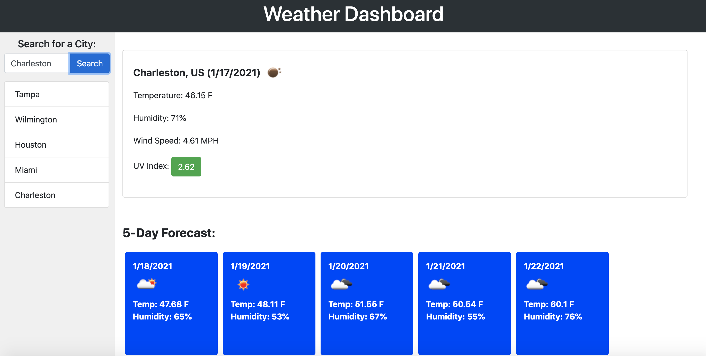

# Weather_API

## Description

For this project, I have created a weather dashboard that will display the current weather conditions along with a 5-day forecast. This information includes the temperature, humidity, windspeed, and the UV index.

The user is able to see recent searches and even can click on these recent searches to return to that location's forecast. The recent searches are located in the sidebar on the left side of the page. The recent searches are saved into the local storage.

The project has been deployed at a live URL. To access the live URL, please click here [Weather_Api](https://alexhstrickland.github.io/Weather_API/).

## Usage

When accessing the website, you will type in a city name into the search input field. If you would like to view a screenshot of the website, check out .